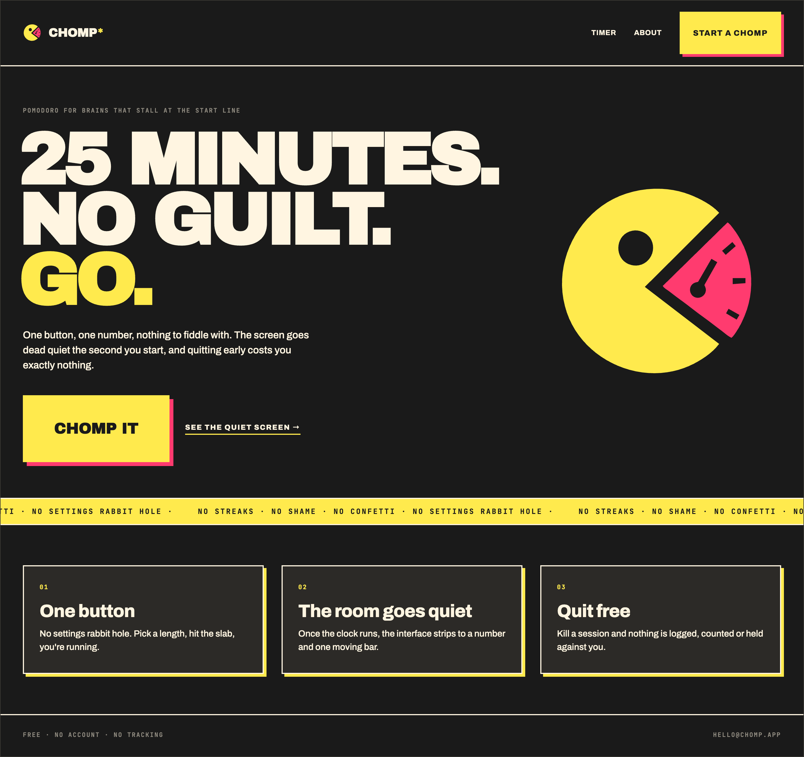

# CHOMP

A pomodoro timer for people who find *starting* harder than concentrating.
Pick a task, hit one big button, work for twenty-five minutes, get a loud
payoff, take a break. That is the whole product.



```bash
pnpm install
pnpm dev          # http://localhost:3000
pnpm check        # biome lint + format
pnpm type-check
```

## Layout

```
src/
├── app/
│   ├── globals.css          design tokens, type scale, motion
│   ├── layout.tsx           the three fonts; ships in .dark
│   ├── icon.svg             tab icon — the Chomp mark
│   ├── page.tsx             marketing landing (hero, marquee, features)
│   ├── about/                about & contact
│   ├── timer/                the state machine — all four screens live here
│   └── kitchen-sink/        every variant, both palettes, the four frames
├── components/
│   ├── chomp/               idle · focus · break · done + the two dialogs
│   ├── site/                 shared nav header + wordmark for the marketing pages
│   └── ui/                  shadcn (base-nova / @base-ui), patched to spec
├── hooks/                   use-timer · use-ambient-sound · use-notifications
└── lib/chomp/               reducer, storage, formatting
```

The app itself lives at `/timer`, chrome-free by design; `/` and `/about` are the
public site that sells it.

`/kitchen-sink` is the verification page: every component variant, the type
scale, both palettes and all four screens rendered as the real components. It
accepts `?palette=solvent`, `?dialog=1` and `?toast=1` so it can be driven
headlessly.

## The rules that are not negotiable

- **Radius is 0.** The only exception is `border-radius: 50%` on stickers.
- **Shadows are hard offsets with zero blur**, always in the *opposite* accent:
  acid casts riot, riot casts acid, neutral casts acid. The sticker's two-part
  shadow is the one place blur is allowed.
- **Ink on riot** is the default pairing. Cream on riot is display-size only.
- **Muted text is the solid tint `#918C81`**, never cream at reduced opacity —
  alpha composites toward the background and quietly fails AA.
- **Riot is an event colour.** Alarm, overrun, delete, break. Two riot elements
  on screen at once means one of them is wrong.
- **No guilt.** One tap starts a session, one tap kills it, no confirmation
  dialog. Abandoned sessions are never counted, never coloured, never mentioned.
  There is no `abandoned` field in the state and there must not be one.

## Timing

The countdown is never driven by `setInterval` arithmetic. `START` stores an
absolute `endsAt`, and `remainingSec` is re-derived from `Date.now()` on every
tick, on `visibilitychange`, on window focus and on hydrate. A session
therefore survives a backgrounded tab, a throttled timer and a refresh; if the
deadline passed while the tab was away, the app lands on DONE rather than
losing the session.

## Palettes

Hazard (default) and Solvent share token names, so switching is
`data-palette="solvent"` on `<html>` with no rebuild.

Both are defined in `globals.css` from the brand hexes. Note that the oklch
column in the handoff's token table does not round-trip to its own hex column
(its cream resolves to `#FAF3E2`, its acid to `#FDE641`); the hexes are what the
reference document paints with, so the hexes won.


